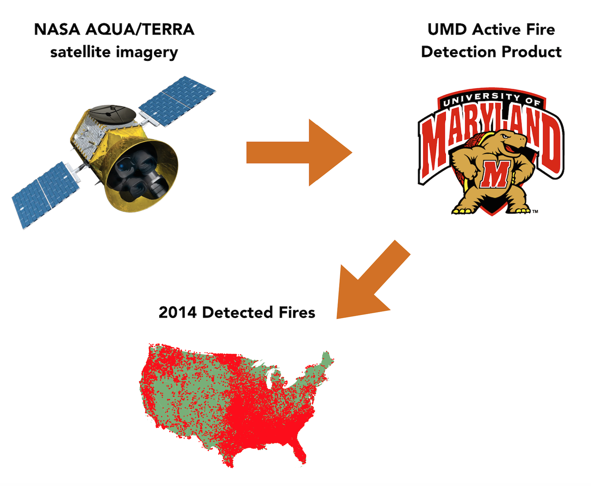

# Building a Model for the Early-Detection of Forest-Fires

To date, hundreds of forest fires have burned over 9 million acres of land in 2015, causing millions of dollars in property damage and unmeasureable loss and pain to those families effected. Currently, satellite imagery of detected fires is not used in real-time to aid in forest fire protection. What if we **could** use that satellite imagery to aid in forest fire protection?

Each day, there are hundreds of satellite images from NASA's AQUA and TERRA satellites that are run through the UMD active fire product. The output of this active fire product is a data set that holds hundreds of 'detected fires' at given latitude/longitude coordinates. We can aggregate this data set to the year level, and see that a map of all detected fires for a given year is incredibly crowded. It's important to note, though, that these fires could be house fires, farmer burn piles, or even forest fires. Currently, this detected fires data set is not used in real-time for forest fire prevention. A large part of this could be that there is no easy way to tease out which of these detected fires are forest fires. What if there was a way that we could parse down this data set into only those detected fires which are forest fires? There is!

Each day, states are required to submit forest-fire perimeter boundaries. If we compare the latitude/longitude coordinates of the dectected fires with the forest-fire perimeter boundaries, we can pare down the detected fires data set to only those fires which are forest fires. The problem with this, though, is that we are doing it historically / after-the-fact. What if we wanted to do this in real time? This is where data science comes in... 

Using data science and machine learning, we can build a model that takes in the detected fires data set and tells us which of those detected fires are actually forest fires.  My current methodology has focused upon using the detected fires data set, along with geographical features, to fit the best predictive model as measured by ROC area under the curve. 

## Current Status / Next steps

Currently, I have finished fitting models (Logistic, Random Forest, Gradient Boosting, Neural Network) using the detected fires data set, along with geographical features. I found that the Gradient Boosting model gave me the highest ROC area under the curve (~0.76).  

My next step is to start including weather data into the model. At this point I have attempted to do this already, but the weather data that I have is not as robust and granular as I need. Once I find such a data set, I am hoping that including weather data will increase predictive power substantially. 

