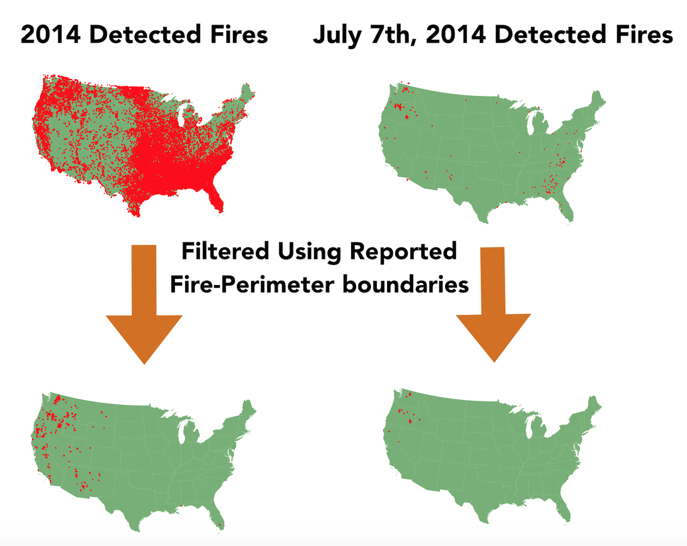
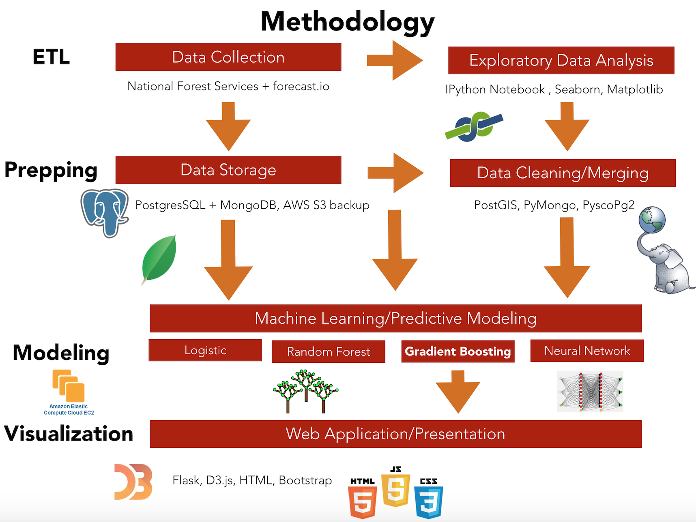

# Building a Model for the Early-Detection of Forest-Fires

To date, hundreds of forest fires have burned over 9 million acres of land 
in 2015, causing millions of dollars in property damage and immeasureable 
loss and pain to those families effected. Currently, satellite imagery of 
detected fires is not used in real-time to aid in forest fire protection. 
What if we **could** use that satellite imagery to aid in forest fire 
protection?

Each day, there are hundreds of satellite images from NASA's AQUA and TERRA 
satellites that are run through the UMD active fire product. The output of 
this active fire product is a data set that holds hundreds of 'detected fires' 
at given latitude/longitude coordinates. We can aggregate this data set to the 
year level, and see that a map of all detected fires for a given year is 
incredibly crowded. It's important to note, though, that these fires could be 
house fires, farmer burn piles, or even forest fires. Currently, this detected 
fires data set is not used in real-time for forest fire prevention. A large 
part of this could be that there is no easy way to tease out which of these 
detected fires are forest fires. What if there was a way that we could parse 
down this data set into only those detected fires which are forest fires? 
There is!

Each day, states are required to submit forest-fire perimeter boundaries. If 
we compare the latitude/longitude coordinates of the dectected fires with the 
forest-fire perimeter boundaries, we can pare down the detected fires data 
set to only those fires which are forest fires. The problem with this, though, 
is that we are doing it historically / after-the-fact. What if we wanted to 
do this in real time? This is where data science comes in... 

Using data science and machine learning, we can build a model that takes in 
the detected fires data set and tells us which of those detected fires are 
actually forest fires.  My current methodology has focused upon using the 
detected fires data set, along with geographical features, to fit the best 
predictive model as measured by ROC area under the curve. 

## Current Status / Next steps

I'm currently in the modeling phase of this project, and working on 
cleaning up some of the code and reworking it in a couple of places to 
make things more efficient and to hopefully get better results. 

After this initial modeling phase, I'm going to work on incorporating
a couple of more data sets that I'm not currently using. 

### Want to follow along, add to my work, or improve on it?

If you fork my repo, from the main folder you can run the command `make data`,
and the data file structure will be created for you with the data downloaded and 
placed into the file structure. 

Note that this assumes you are working from a unix terminal (or a linux with 
curl installed), with PostgresSQL and a version-consistent PostGIS extension 
installed. When running the `make data` command, you'll have to have a
PostgresSQL server running in the background. 

After this, you can run the command `make features`, which will create for you 
a .csv that holds the data ready to run through models (from this point you can 
read it into a Pandas DataFrame to run through models). After this command, 
the model inputs will be in a file named `geo_time_done.csv`, stored in the 
`code/modeling/model_input` folder. Note that this `make features` command will take 
some time. For me, even on a 40 core machine on AWS, it took ~2 1/2 hours. 

### Get in touch 

Feel free to email me anytime at sean.sall@galvanize.com. 
